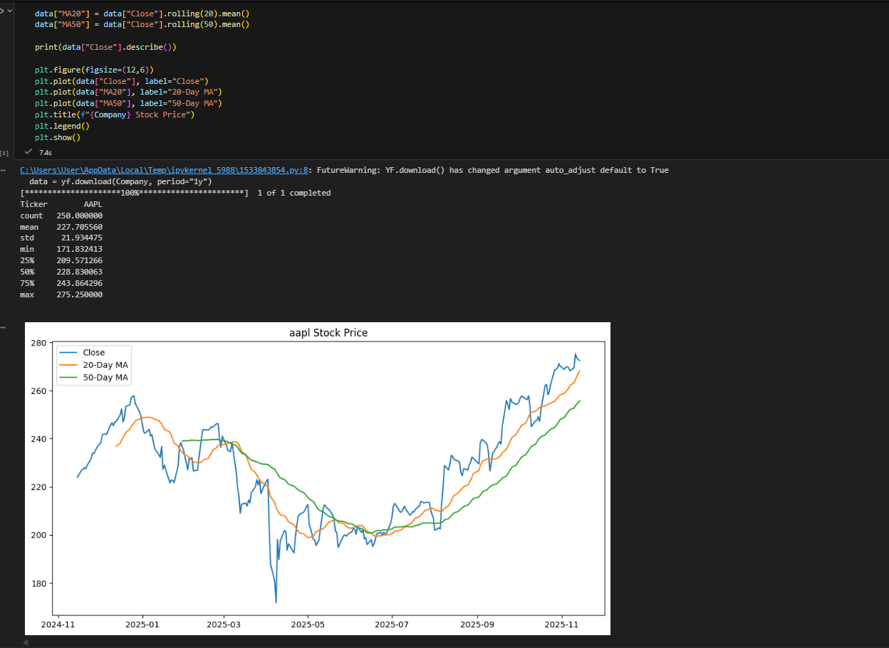

# Python Stock Analyzer

##  Description
This project is a Python-based **Stock Analyzer** that retrieves historical stock price data, visualizes trends, and calculates basic performance metrics. It uses `yfinance`, `pandas`, and `matplotlib` to pull real market data and generate insights.

The tool allows you to:
- Download historical stock price data over the span of 1 year.
- Visualize closing prices over time.
- Calculate returns and performance metrics.
- Analyze investment trends for any stock ticker.

---

##  Project Files
- [Stock_analysis](stock_analysis.ipynb) — main script containing the stock analysis code.
- [requirements.txt](requirements.txt) — list of dependencies needed to run the project.
- [screenshots](screenshots/) — folder containing output charts.

---

##  Requirements
The project uses the following Python libraries:
yfinance
pandas
matplotlib

## How to Run the Project
-pip install yfinance pandas matplotlib
-Run the main script
-When prompted, enter a stock symbol, e.g.: AAPL,MSFT,TSLA

## Screenshot

